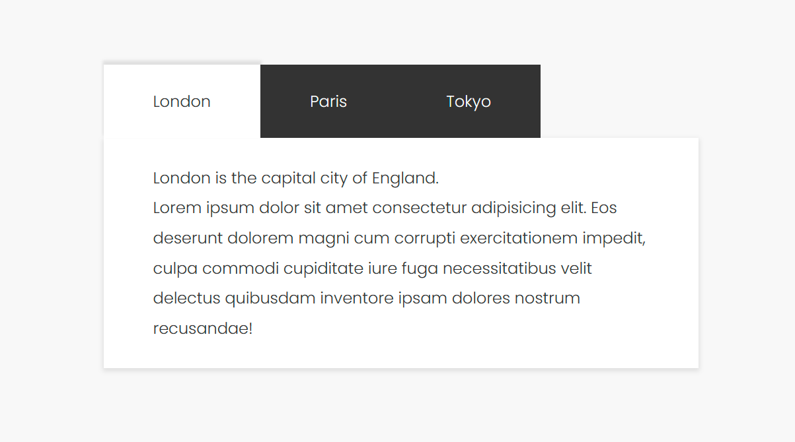

## Creating a Simple Navigation Tab Menu with CSS and JavaScript

In this tutorial, I will demonstrate how to use CSS and JavaScript together to create a simple navigation tab menu. This type of menu is perfect for providing quick navigation within user interfaces, enhancing the interactivity and user experience of websites.

First, check out the [demo](https://cnbjjj.github.io/navigation-tabs/demo.html){:target="_blank"}.



Let's get started!

### HTML Structure

Our HTML structure consists of two basic parts: `nav` for the tab buttons and `section` for the content corresponding to each tab. Note that in this example, the order of tabs and content is crucial; they need to be arranged in the same order to ensure the correct tab displays its corresponding content.

```html
<nav>
    <div class="selected">London</div>
    <div>Paris</div>
    <div>Tokyo</div>
</nav>
<section>
    <div class="selected">
        <p>London is the capital city of England.</p>
    </div>
    <div>
        <p>Paris is the capital of France.</p>
    </div>
    <div>
        <p>Tokyo is the capital of Japan.</p>
    </div>
</section>
```

### CSS

With CSS, we set it up so that all tab contents are hidden by default, and only the selected tab and its content are displayed. With the `.selected` class style changes, you can customize the appearance of the selected tab and content as you wish.

```css
/* Default navigation tab style */
nav > div {
    color: #fff;
    background-color: #333;
    cursor: pointer;
}
/* Selected navigation tab style */
nav > div.selected {
    color: #333;
    background-color: #fff;
    cursor: default;
}

/* Hide tab content by default */
section > div {
    display: none;
}
/* Display the selected tab content */
section > div.selected {
    display: block;
}
```

### JavaScript

JavaScript plays a crucial role. When a user clicks on any tab, we first check if the clicked tab is the one currently displayed. If not, we change their display state by toggling the `selected` class. Here's the core code to implement this logic:

```javascript
// Find the currently selected tab in the navigation.
const currentTab = document.querySelector('nav > .selected');

// Check if the clicked tab (referred to as 'nav' in this context) is already the selected one.
// If it is, do nothing to avoid unnecessary changes.
if (nav === currentTab) return;

// If not, remove the 'selected' class from the currently selected tab 
// and add it to the clicked tab to highlight it as the new selection.
currentTab.classList.remove('selected');
nav.classList.add('selected');

// Retrieve all content sections.
const allTabContent = document.querySelectorAll('section > div');

// Loop through all content sections.
allTabContent.forEach((content, contentIndex) => {
    // Toggle the visibility of the content: hide the previously shown content
    // and show the content corresponding to the newly selected tab.
    // This is determined by matching the content index with the index of the clicked tab.
    if (content.classList.contains('selected') || contentIndex === index) {
        content.classList.toggle('selected');
    }
});
```

### Conclusion

Through this simple project, I have learned a lot by combining HTML, CSS and JavaScript. I hope this tutorial helps you, and feel free to adjust the styles and functionality according to your needs.  

Have Fun!

### References

- [W3.CSS Navigation Tabs](https://www.w3schools.com/w3css/w3css_tabulators.asp)
